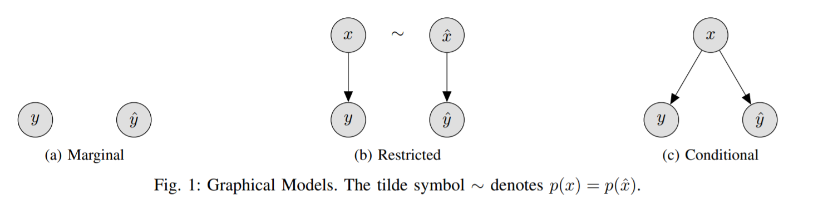
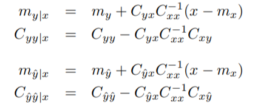
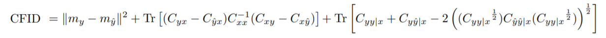
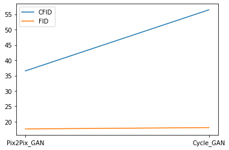

<br><br><br><br>

# CFID
[Project Page](https://michael-soloveitchik.github.io/CFID/) |  [Paper](https://arxiv.org/abs/2103.11521) | [Code](https://github.com/Michael-Soloveitchik/CFID/)


TensorFlow2 implementation of Conditional Frechet Inception Distance metric. For example, given a low-resolution (LR) image, ground-truth high-resolution image (HR) and some super-resolution model (SR). The CFID metric is able to measure the exact distance between HR and SR given LR. In comparison to classic Frechet Inception Distance (FID), CFID considers the input LR image. It measureד the similarity between HR and SR regarding the input image. Unlike FID, CFID requires paired (LR,HR) data for comparison.

We also describe RFID metric as condidate for measuring the distance between distributions, as more simple variant. The corresponding graphical models describe the difference between the metrics: 

FID, RFID, CFID
  

**Note**: The current software works well with TensorFllow 2.4.0

<!--    -->
**Conditional Frechet Inception Distance.**  
[Michael Soloveitchik](https://new.huji.ac.il/people/%D7%9E%D7%99%D7%9B%D7%90%D7%9C-%D7%A1%D7%95%D7%9C%D7%95%D7%91%D7%99%D7%99%D7%A6%D7%99%D7%A7/),
 [Tzvi Diskin](https://new.huji.ac.il/people/%D7%A6%D7%91%D7%99-%D7%93%D7%99%D7%A1%D7%A7%D7%99%D7%9F/), [Efrat Morin](https://en.earth.huji.ac.il/people/efrat-morin/), [Ami Wiesel](https://www.cs.huji.ac.il/~amiw/).  
 The Hebrew University of Jerusalem, 2021.

### Formulas

The CFID formula is rather similiar to FID thus simple and easy to implement. Given:

  

CFID defined as follows:
  

## Example results
'good' models defined to be those which output corellate visually with the input. For example when the SR image could be donwsampled back to it's LR input. CFID distinguish between 'good' and 'bad' models while the classic FID metric doesn't. Most of the models that trained on paired data considered to be 'good'. 
We provide comparasion of CFID with FID on 'good' and 'bad' models. 

The 'good' models are: [Pix2Pix](https://phillipi.github.io/pix2pix/) and [BiCycle-GAN](https://junyanz.github.io/BicycleGAN/) (The were trained on paired data).

The 'bad' models are: [Cycle-GAN](https://junyanz.github.io/CycleGAN/) and [MUNIT](https://github.com/NVlabs/MUNIT) (They were trained on un-paired data) 

The models were trained on [Celeb-A](https://www.tensorflow.org/datasets/catalog/celeb_a) dataset
- **Pix2Pix vs Cycle-GAN**
-   
- **biCycle-GAN vs MUNIT**
-   

## Prerequisites
- Windows, Linux or macOS
- Python 3
- CPU or NVIDIA GPU + CUDA CuDNN


## Getting Started ###
### Installation
- Clone this repo:
```bash
git clone -b master --single-branch https://github.com/Michael-Soloveitchik/CFID.git
cd CFID
```
- Install TensorFllow and dependencies from https://www.tensorflow.org/ 


### Citation

If you find this useful for your research, please use the following.

```
@misc{soloveitchik2021conditional,
      title={Conditional Frechet Inception Distance}, 
      author={Michael Soloveitchik and Tzvi Diskin and Efrat Morin and Ami Wiesel},
      year={2021},
      eprint={2103.11521},
      archivePrefix={arXiv},
      primaryClass={cs.LG}
}
```
### Acknowledgements

  The authors are with The Hebrew University of Jerusalem, Israel . This
research was funded by Center for Interdisciplinary Data Science (CIDR) in
the Hebrew University, Israel.
